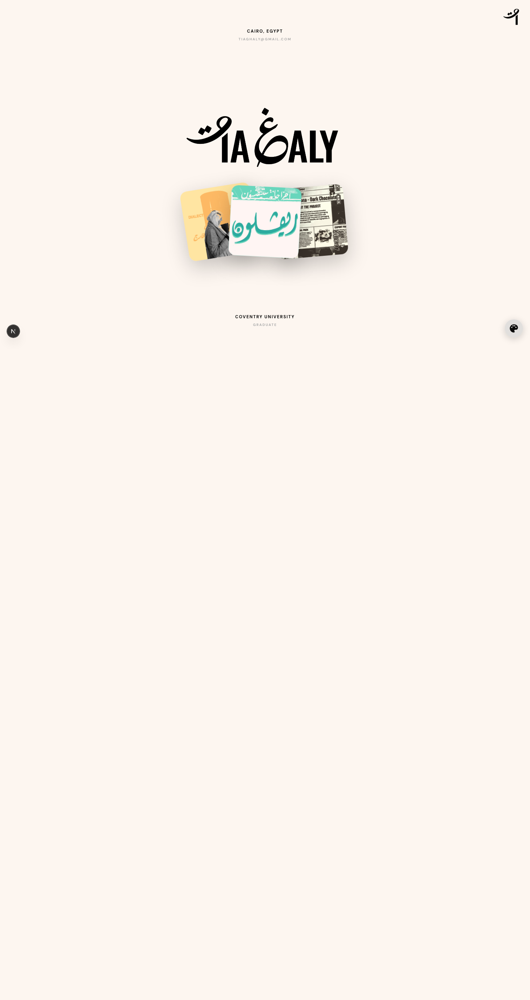
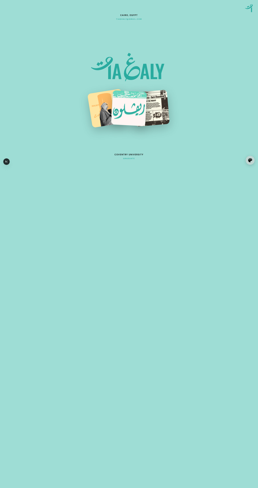
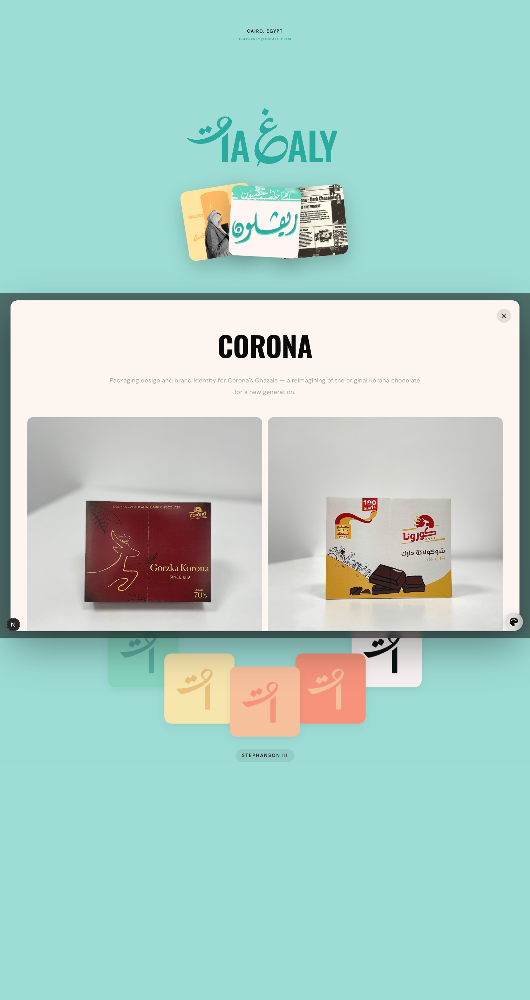
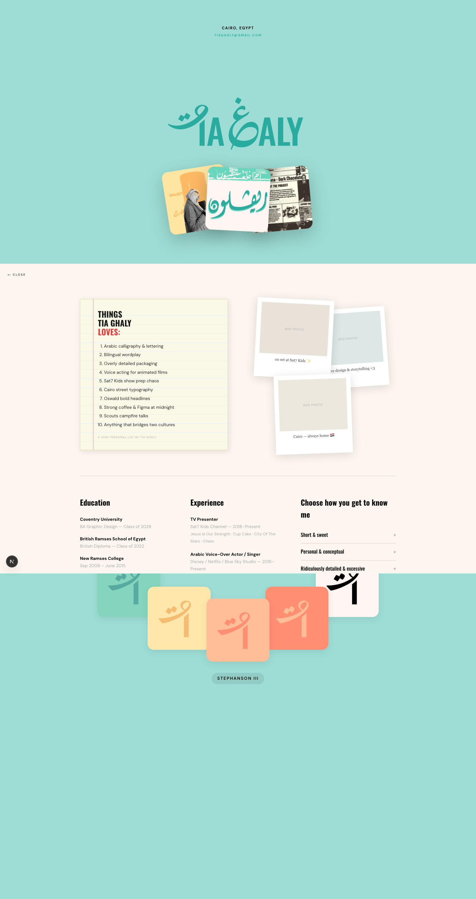
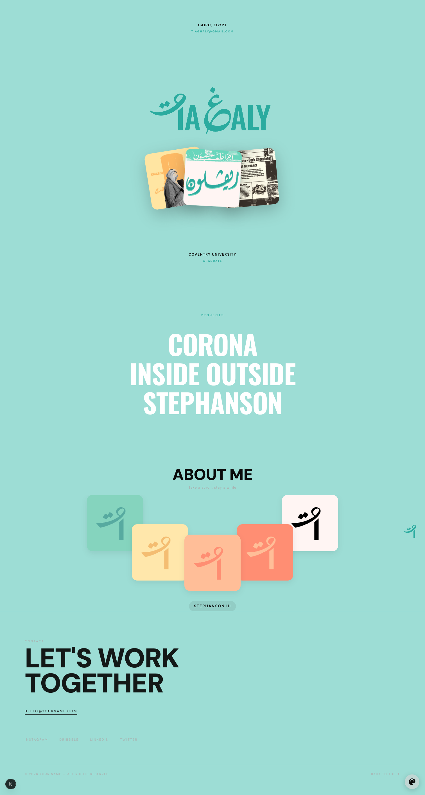

# Graduation Project Documentation

## Project Overview

This website is a personal portfolio for Tia Ghaly, built with Next.js (App Router), TypeScript, and Tailwind CSS. It showcases a clean interactive portfolio experience with a strong visual identity, theme modes, and responsive project displays.

The main goal is to present Tia's work, biography, and contact details in a polished, accessible format that feels modern and professional.

## Website Structure

### 1. Header
- Contains the site brand and a theme toggle.
- Includes a `T` icon button that opens the `About` overlay on click.
- File: `components/Header.tsx`

### 2. Hero Section
- Full-screen introduction area with a custom animated logo and three overlapping project cards.
- Uses a playful physics-driven card interaction.
- The hero section includes location and contact quick info.
- File: `components/Hero.tsx`

### 3. Projects List
- Displays project cards in the second section.
- Each project opens an overlay modal with detailed project description and image gallery.
- The modal uses a neutral background regardless of the active color mode.
- File: `components/ProjectsList.tsx`

### 4. More Work
- Additional portfolio cards or secondary work examples.
- File: `components/MoreWork.tsx`

### 5. Contact Section
- Simple contact block with email, phone, and location details.
- File: `components/Contact.tsx`

### 6. About Overlay
- Full-screen overlay with biography, education, exhibitions, awards, experience, and contact details.
- The overlay is theme-isolated and uses a blush cream background.
- File: `components/About.tsx`

## Key Features

- Responsive layout for desktop and mobile
- Four theme modes: Blush, Mint, Yellow, Coral
- Neutral modal background for project overlays
- Animated hero cards with gentle physics motion
- Scroll-locking overlays for better modal experience
- Accordion-style biography panel in the About overlay

## Theme Colors

- **Blush / Neutral**: `#fdf6f0`
- **Mint**: `#9dddd5`
- **Yellow**: `#ffe5a4`
- **Coral / Pink**: `#f5846f`
- **Neutral text / muted**: `#ababab`
- **Primary text**: `#0a0a0a`
- **Border / subtle line**: `#d8d1c8`

## Pages and Sections for Screenshots

Use these recommended screenshots to explain the website in your project document.

### Screenshot 1: Home / Hero Section
- Show the main hero page with project cards and logo.
- Include the top meta info (`Cairo, Egypt` and email) if possible.



### Screenshot 2: Theme Toggle and Mode
- Show one of the alternate color modes (Mint / Yellow / Coral).
- Include the theme toggle UI if visible.



### Screenshot 3: Project Modal
- Open a project from the Projects List and capture the overlay.
- Show the neutral background and close button.
- Demonstrate the image grid layout with 2 images on top and 4 images below if possible.



### Screenshot 4: About Overlay
- Click the `T` icon and capture the About overlay.
- Include the top notebook-style “Things Tia Ghaly Loves” section and the biography columns.



### Screenshot 5: Contact / More Work
- Capture the bottom contact block and/or the More Work section.
- Show how the page continues below the main hero.



## Recommended Screenshot File Names

- `screenshot-hero.png`
- `screenshot-theme-mint.png`
- `screenshot-project-modal.png`
- `screenshot-about-overlay.png`
- `screenshot-contact.png`

## How to Run Locally

1. Open the project folder in terminal.
2. Run:
   ```bash
   npm install
   npm run dev
   ```
3. Open the browser at `http://localhost:3000`.
4. Navigate through the site, open the About overlay, and open a project modal.

## Notes for Presentation

- Emphasize the responsive design and project-focused layout.
- Mention the theme system with neutral overlay behavior.
- Highlight the use of Tailwind CSS and Next.js App Router.
- Explain the custom modal and scroll-lock behavior in the Projects List.

---

### Optional Additions

If you want, I can also generate a second markdown file with a full project narrative and screenshot captions ready for printing or slide presentation.
